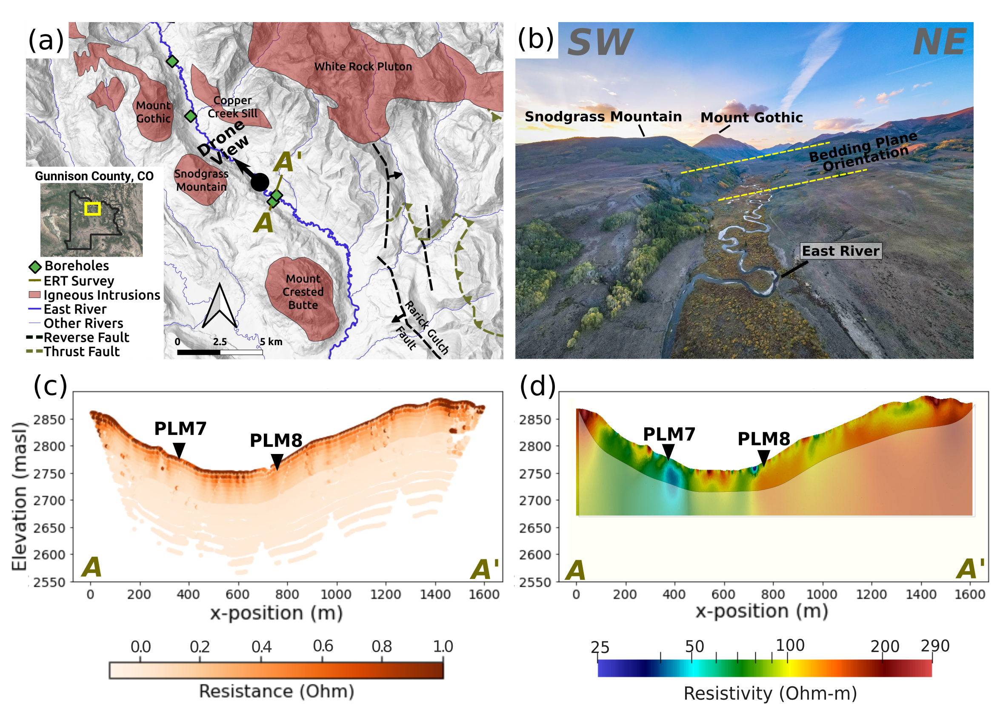
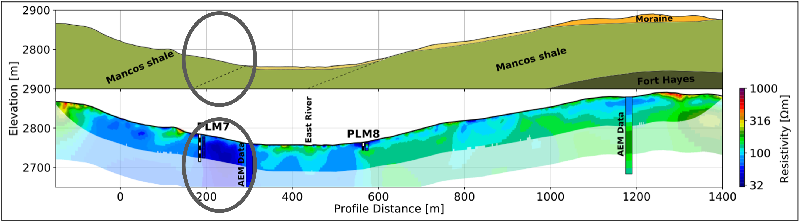
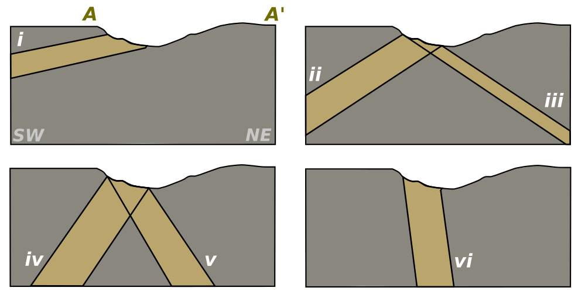
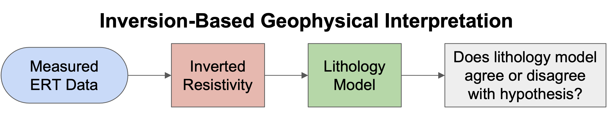
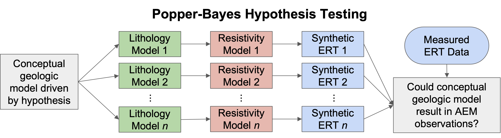
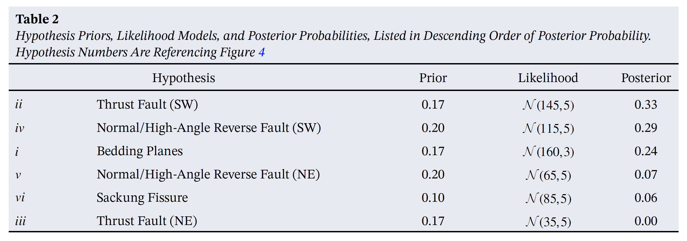

# Bayesian hypothesis testing

I love this study because it's a great illustration of how quantitative hypothesis testing methods can help us identify and understand geological structures from complicated datasets.

Here's a little bit of background. The East River Watershed is a big U.S. Department of Energy study site in Colorado. A lot of exciting work around ecosystems, hydrology, and nutrient cycling is happening here. 
A big part of watershed hydrology is groundwater, so my goal when I entered this project was to understand the geological features controlling groundwater flow in this region.

We had geological maps, geophysical data, and some borehole data including pump tests to measure hydraulic conductivity. The map below shows some of the information.

Closer inspection of the geophysical data revealed an electrically conductive anomaly just south of the East River. This shows up in both the surface electrical resistivity data and the airborne electromagnetic data. 
One of the boreholes intersects this anomaly. The core log in this borehole shows a highly fractured shale bedrock, and the pump test shows that this zone has orders of magnitude higher hydraulic conductivity. 
Since the anomaly extends along the length of the valley, this could be an important subsurface flow pathway. However, geological maps show no sign of anything in this area, probably because it is hidden beneath a thick soil layer. 

The big question is: *what created this fracture zone?* If it was a fault, then that has huge implications for how we structure a groundwater model. So, we asked around, scoured the literature, and came up with six hypotheses for what could create this fracture zone. The figure below summarizes these six hypotheses.

Note that the main feature differentiating these hypotheses is the dip angle of the fracture zone.

## Testing Geological Hypotheses with Geophysical Data
There are a lot of uncertainties to account for in this kind of hypothesis test. The multiple hypotheses represent *conceptual* uncertainty that we are trying to reduce. 
There is also uncertainty in the geophysical measurements, or *measurement error*. And finally, there is *nonuniqueness* in the geophysical data, i.e. more than one subsurface model can give the exact same geophysical response. 

Dealing will these three sources of uncertainty requires a formal probabilistic framework for hypothesis testing. However, the most common way of interpreting geophysical data goes something like this:  

Basically, we perform an inversion on the geophysical data to get a subsurface map of resistivity or other physical property. Then, these resistivities are interpreted or transformed into rock type which gives us a subsurface map of inferred rock type. Then, these models are viewed by a team of geologists and geophysicists who, using their expert judgment, determine which hypothesis is most correct.

The hard part with this approach is that there is uncertainty in each step along the way. There are ways to account for uncertainty in this framework, but they are subjectively applied and approximate.

When you think of how physicists conduct experiments, they start with a hypothesis, set up a controlled experiment, and use a mathematical model to predict how the system will respond under their theory. They *test* their ideas against the data. If the measurements are what the theory predicted, then the theory holds more weight in the real world.

This experimental process is the motivation behind this Popper-Bayes hypothesis testing approach (visualized below). We *start* with the hypothesis and see if it can reproduce the observed measurements.

Now, there are great reasons why this is an uncommon approach in geophysics. First, we don't have nice, controlled experiments like most laboratory physicists do. Therefore we have to deal with uncertainties in the conceptual -> lithology model and the lithology -> resistivity model.
Add on measurement error and you have a complex problem. 

In my paper I approached this problem by assuming at least one of the six hypotheses were correct, and then calculating the posterior probabilities of all hypotheses given the geophysical data. 

$$
\textrm{P}(h | \mathbf{d}) \propto \textrm{P}(h)\int_{\Omega_\mathbf{m}} \textrm{P}(\mathbf{m} | h) \,\textrm{P}(\mathbf{m} | \mathbf{d})\,\textrm{d}\mathbf{m}
$$

In hindsight, there is a better way to formulate this problem. However, sticking with this approach we have three main components. First, $\textrm{P}(h)$ represents a prior on our hypotheses. We defined these during the problem setup.
Second, $\textrm{P}(\mathbf{m} | h)$ represents the likelihood of the dip angle under each hypothesis. We also defined these during the problem setup, based on geological information.
And finally, we have $\textrm{P}(\mathbf{m} | \mathbf{d})$ which represents the posterior density of fracture zone dip angle given the observed geophysical data. This distribution must be calculated.

Calculating the posterior of the dip angle given the geophysical data was done using a technique called machine learning dimension reduction. Essentially, we learn the relationship between geophysical data and dip angle from the prior. We then apply this trained model to the measured data to estimate the true dip angle. At the end, we get an estimate of 
$\textrm{P}(\mathbf{m} | \mathbf{d})$.

## Results & Takeaways

After all is said and done, we get the following posterior probabilities for each hypothesis.

We can see that this zone is almost certainly dipping towards the southwest. Most likely, this is a fault we're dealing with, but it could be a sedimentary layer as well. If this feature is in fact a fault, then sedimentary layers and igneous intrusions in this area may be offset. This is important because breaks in geological layers can have huge effects on groundwater flow. However, if we trust the geological maps as-is, then we may miss features like this fault.

## References

Link to paper...

Link to AGU
