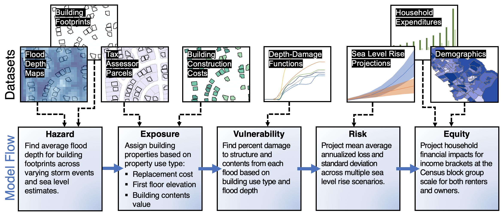
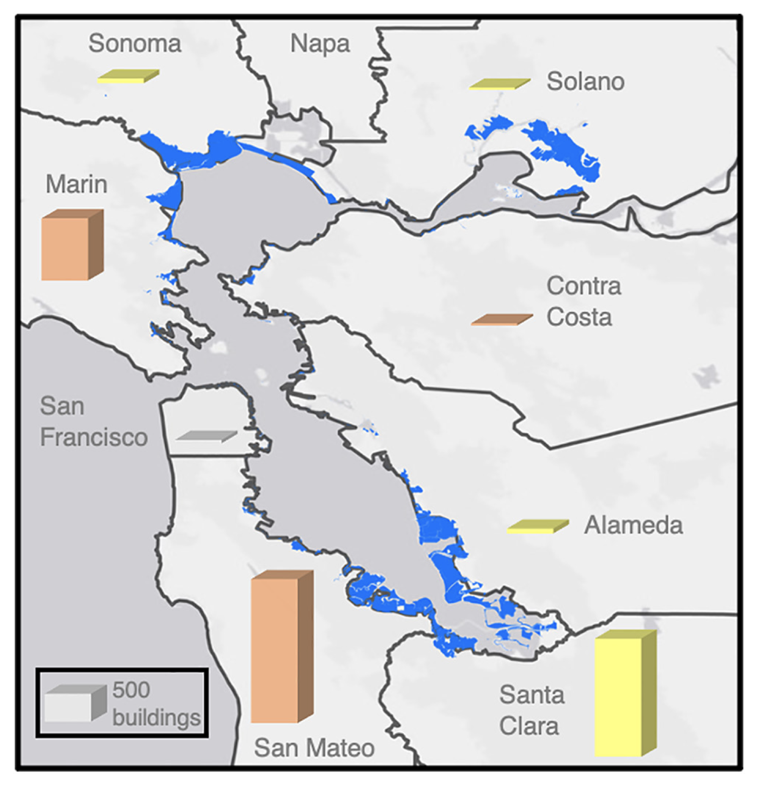
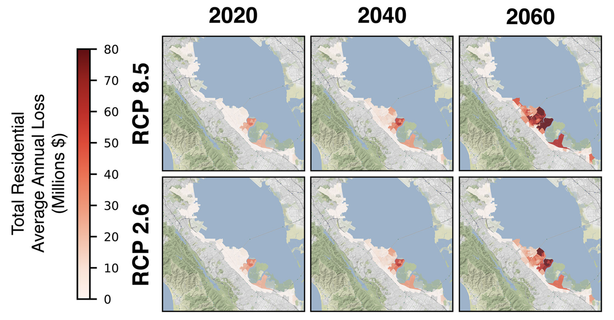
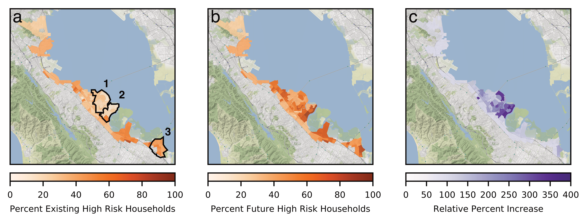

# Estimating future property damage due to increased flooding

Our climate is changing, and coastal communities across the world are preparing for more flooding as sea levels rise and large storms becomes more common.
However, the magnitude of this impact varies spatially, and not everyone will be equally impacted.
In this project, my colleagues and I set out to quantify the future financial impact of flooding, and who will be impacted most.

The details of this methodology were [published in Earth's Future](https://www.researchgate.net/publication/353199882_Rising_Seas_Rising_Inequity_Communities_at_Risk_in_the_San_Francisco_Bay_Area_and_Implications_for_Adaptation_Policy)
and I want to give a shout-out to the top-knotch team, especially [Avery Bick](https://www.linkedin.com/in/ian-avery-bick/), [Adrian Santiago-Tate](https://www.linkedin.com/in/adrian-santiago-tate/), and [Arnav Mariwala](https://www.linkedin.com/in/arnavmariwala/) for making this happen. This work was awarded first place at the [Stanford Big Earth Water Hackathon](https://earth.stanford.edu/news/big-earth-water-hackathon-drives-solutions-hydropower-sanitation#gs.8bl4zg) in 2019
and formed the basis of [HighTide](https://hightide.ai/), an awesome company building tools for flood risk analysis. Code is available [here](http://zapad.stanford.edu/sigma/ef-2021-inequityrisk-bayarea).

We focused our analysis on the San Francisco Bay Area, but the framework is generalizable to other coastal areas. Below I will discuss how we came up with these predictions.

## Data Sources

1. Flood Maps from [Our Coast Future](https://ourcoastourfuture.org/)
2. Sea level rise projections from the IPCC for these three emissions scenarios:
    a. RCP 2.6
    b. RCP 4.5
    c. RCP 8.5
3. Tax assessor data from AECOM that tell us whether a building is industrial, commercial, or residential
4. Empirical depth-damage curves from the U.S. Army Corps of Engineers. This is used to relate flood depth to building damage
5. Building footprint data from [Microsoft OpenStreetMaps](https://wiki.openstreetmap.org/wiki/Microsoft_Building_Footprint_Data_#California)
6. Construction cost data from RSMeans (proprietary)
7. Number of floors per building, from Corelogic
8. Demographic and income data at the block-group level, from the U.S. Census Bureau
9. Flood recurrence rates
10. Digital elevation model (DEM)

As you can see, this is a diverse dataset. Some of the challenges here are:

1. Probabilistically adjusting flood maps based on the DEM, storm levels and frequency, and sea level rise
2. We have census data at the block-group scale, but want a building-scale analysis of financial impacts
3. Turning flood levels into structure damage, in $$$

There are a lot of details involved, so I encourage you to check out the paper for more details. Skipping ahead, I will talk about some key insights from this analysis.

## People living in the South Bay will be impacted most

The southern and northern parts of the San Francisco Bay Area will be most effected by sea level rise. In Marin, Napa, and Sonoma counties much of this land is uninhabited marsh, hence the low building damage. However, the southern regions of San Mateo and Santa Clara Counties are built up so more residential, commercial, and industrial areas will be subject to flooding.

## Flood damage will increase over the next 40 years

You can see that most of the flood damage until 2040 will be in neighborhoods around East Palo Alto. Between 2040-2060 a threshold will be crossed, and the neighborhoods of Redwood Shores and Foster City will be impacted more.
Since the average incomes in Foster City & Redwood Shores are much greater than East Palo Alto, the average annualized loss in those communities will be much greater once they start flooding more regularly.

## Future flood risk is concentrated near Redwood Shores and Foster City

Echoing the points above, This figure just shows that Foster City and Redwood Shores are facing the greatest change in flood risk in the next half century.

That's it for now!

### References
[Rising Seas, Rising Inequity?](https://www.researchgate.net/publication/353199882_Rising_Seas_Rising_Inequity_Communities_at_Risk_in_the_San_Francisco_Bay_Area_and_Implications_for_Adaptation_Policy)

[Stanford Big Earth Water Hackathon](https://earth.stanford.edu/news/big-earth-water-hackathon-drives-solutions-hydropower-sanitation#gs.8bl4zg)