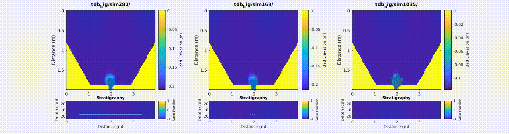
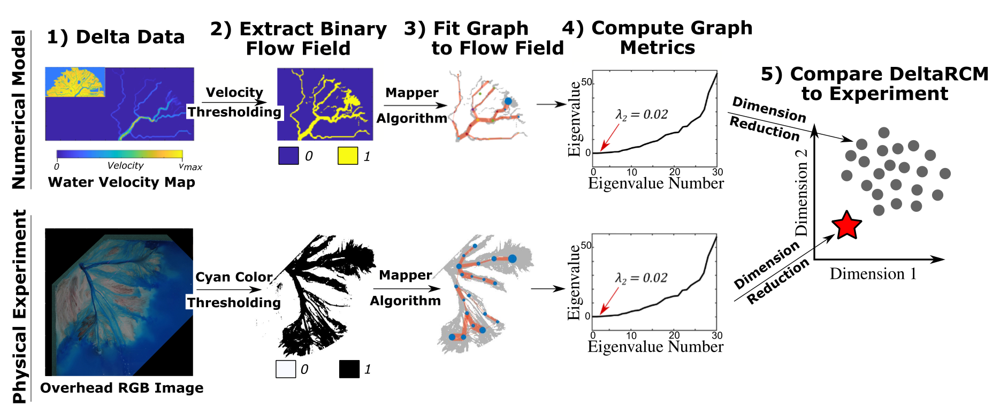
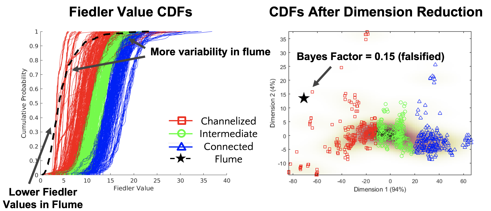

# Understanding river delta dynamics

River deltas change *constantly*. This is natural, but not great for people and infrastructure residing on deltas. Famous cities on deltas include New Orleans, USA, Alexandria, Egypt, and Kolkata, India. 
A lot of effort has been put in to modeling how river deltas change. There are many different aspects here - shoreline expansion and retreat, land subsidence (sinking), and river migration. 
Predicting how rivers move over time is especially challenging for two main reason. First, there are a lot of factors that control this, including flooding, sediment type, connection to the ocean, and more. 
Second, it is hard to account for all these effects in quantitative models that can predict how a delta's channel network will evolve over time. Even Delft3D, probably the best coastal fluid dynamics & sediment transport model out there, struggles to re-create realistic channel dynamics (as of this writing, at least).

I believe one way we will be able to predict changes in delta channel dynamics. The way I see it, the main barrier between us and that future is a rigorous way to compare simulated deltas to real deltas. That is the motivation for this work. My colleagues and I set out to devise a rigorous way to compare channel networks simulated deltas and real deltas.
There are two main reasons this problem is so hard. First, not all the parameters in numerical delta models can be measured in the field, so there is uncertainty around how to set the values of these parameters. The second reason is that it is hard to quantify a delta's channel network dynamics.
We decided to use Monte Carlo methods to tackle the uncertainty problem, and topological graph theory to solve the second problem. 

I will not go into all the details, but I will describe the numerical model, the framework for making this comparison, and what we learned from this exercise.

## DeltaRCM
There are many models that simulate river deltas. I mentioned Delft3D above, but it isn't designed specifically to simulate delta channel dynamics over long periods of time. Instead, we used DeltaRCM. RCM stands for *reduced complexity model*, meaning that it captures the core fluid dynamics and sediment transport using physical relationships, but substitutes some of the more complex parts, such as channel avulsions, with a stochastic component.
The original model was created in MATLAB ([see the original paper]()), and has since been refactored into Python (PyDeltaRCM)to improve stability and usability. I highly recommend checking out the [open-source code](link) and the [corresponding paper](link).

Below is an example of one simulation you can create with DeltaRCM. Note that there are about 28 parameters that you can tweak here to change the behavior of the delta.

You can see how the channels migrate similarly to the satellite images at the top of the page. The question becomes, how do we know this model is realistic? The eye test isn't enough here, so it's time to set up an experiment.

## Flume Experiment

These types of experiments are designed to simulate real-world deltas (and other landforms) at a scale that is accessible for human study. It is impossible to follow a natural delta over thousands of millions of years, so flume experiments are the closest we have to studying how deltas evolve over time.
The flume experiment data we used were from [Prof. Kyle Straub]'s lab at Tulane University, in a 4 x 6 foot tank. Below you can see an animation of what that experiment looks like in real-time.

The researchers can control for variables like the volume of water and sediment fed into the tank, the type of sediment, and the rate of sea level rise. However, DeltaRCM requires setting parameters that cannot be controlled experimentally, like the relative influence of inertial and diffusive forces.

## Comparing DeltaRCM to the experiment

Since we cannot control all of the DeltaRCM parameters experimentally, we need a way to account for the uncertainty in these parameters. In the [paper] you will find a table with ranges of values we used for all 24 uncertain parameters. Since these unconstrained parameters take on a range of values, we use Monte Carlo simulations to generate a *distribution* of possible DeltaRCM simulations.

This is a key point: once we have a distribution of possible DeltaRCM simulations, we can ask "does the flume experiment fall within the distribution of DeltaRCM simulations?" This is similar to a standard hypothesis test with p-values, except our distribution is so complicated that none of these p-value methods will work effectively. 
We need a way to *reduce the dimensionality* of our distribution and a new hypothesis testing method.

### Dimensionality Reduction
This step just means taking our complicated distribution and extracting a few meaningful summary statistics. In our case we are interested in the channel dynamics, so we choose a metric that describes the overall shape of the channel network.

We accomplish this task using methods from Graph Theory. My colleague Erik Nesvold did some excellent work on this in his [PhD thesis](link), showing how you can fit graphs to delta channel networks and use those graphs to distinguish different patterns in the channel networks. We borrowed this method to fit graphs to our delta channel networks.
Below you can see what it looks like once we fit these graphs to DeltaRCM and the flume experiment. A clustering algorithm was used to illustrate the different types of DeltaRCM simulations that are possible in these circumstances.

### Hypothesis Testing

Once we have the graphs, the rest is straightforward. The workflow below shows how we will compare the simulated and experimental deltas to one another. 

We quantify channel network shape using the Fiedler value, a graph metric that in this case describes how interconnected the channels are at any time step. The more connections between channels, the higher the Fiedler value. 

Because each delta has many time steps, we aggregate these metrics over all time steps to create metric distributions. Each simulation gets its own distribution. Then, we use a metric to quantify the distance between distributions to create a distance matrix between all simulations. The distance matrix is fed into an algorithm called multidimensional scaling that then maps every simulation to a point on a 2D space. The distributions and the 2D space are visualized below.

If we want, we can put a number on how well the flume matches the simulations. The framework we use is the Bayes Factor. If the Bayes Factor is less than 1, then the null hypothesis explains the data better than our model, and vice versa if the Bayes Factor is greater than 1. Normally, the Bayes Factor is difficult to calculate for these problems but during my PhD I showed how we can rewrite the Bayes Factor in the following form for this problem

$$ 
B = \frac{\int_{\Omega}\textrm{P}_\textrm{flume}(\mathbf{x})\textrm{P}_\textrm{RCM}(\mathbf{x})\,\textrm{d}\mathbf{x}}
{\int_{\Omega}\textrm{P}_\textrm{flume}(\mathbf{x})\textrm{P}_\textrm{null}(\mathbf{x})\, \textrm{d}\mathbf{x}}
$$

where $B$ is the Bayes Factor, $P_\textrm{flume}$ is the distribution of flume experiment results, $P_\textrm{RCM}$ is the DetlaRCM distribution, and $P_\textrm{null}$ is the distribution representing the null hypothesis. The null hypothesis is a uniform distribution in this case. 

The above equation simplifies to the equation below because $\textrm{P}_\textrm{flume}$ is a Dirac delta function.

$$ 
B = \frac{\textrm{P}_\textrm{RCM}(\mathbf{x}_\textrm{flume})}
{\textrm{P}_\textrm{null}(\mathbf{x}_\textrm{flume})}
$$

where $\mathbf{x}_\textrm{flume}$ is the value of the flume experiment. It get's a little confusing because $\mathbf{x}$ represents a distribution, but that's a technical detail. 

If we do this calculation, we end up with $B=0.15$, meaning that the channel networks in the flume experiment are not equivalent to the channel networks simulated by DeltaRCM.

## Key Insights

After all this analysis, we can see that there are some key differences between DeltaRCM and the flume experiment, shown by both Bayes Factors being less than 1.  
The channels are not finely resolved in DeltaRCM, so we see much more isolated channel networks in the flume experiment. This is why the Fiedler values for the flume tend to be smaller than for DeltaRCM.

After this study, we concluded that more work was needed to improve the stability of DeltaRCM. More stability should help us simulate deltas at a higher resolution, resolving the fine-scale channels that appear important for controlling channel network dynamics.
Many of these issues have since been resolved in the [new version of PyDeltaRCM](link!), but we would need to re-run this analysis again to make sure!

The bigger picture is that this kind of Monte Carlo hypothesis testing framework can help us test new geological models against real data. The process of iterative testing will lead to more accurate geological models, which will improve our understanding of Earth processes and help us better manage our natural resources.

## References
Paper...

DeltaRCM...

PyDeltaRCM

My Github repo...

Erik Nesvold's work...

Kyle Straub...

